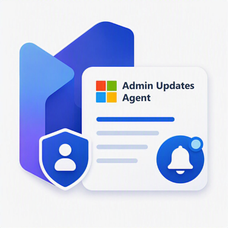
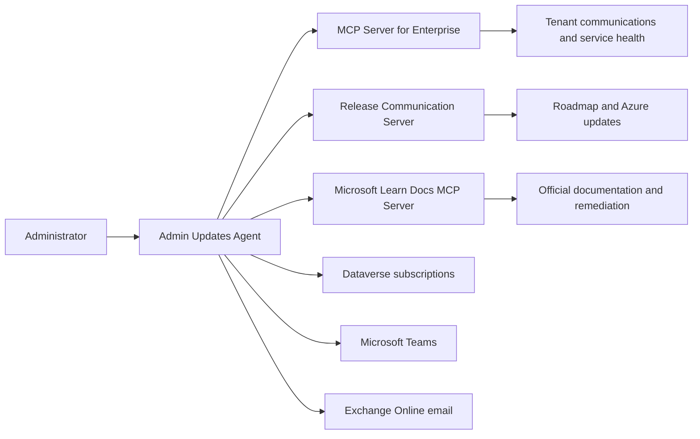

# Admin Updates Agent

Admin Updates Agent is a Copilot Studio reference agent for Microsoft 365 and Azure administrators. It correlates tenant communications, public release information, and Microsoft Learn documentation, then turns the evidence into concise operational guidance.

This is an independent community reference implementation. It is not developed, endorsed, or supported by Microsoft.

## Capabilities

- Search tenant-specific Message Center posts and Service Health incidents or advisories.
- Search public Microsoft 365 Roadmap items and Azure Updates.
- Enrich findings with official Microsoft Learn documentation.
- Investigate the relationship between a public change, tenant impact, known issues, and administrator actions.
- Manage per-user weekly digest preferences in Dataverse.
- Deliver filtered weekly digests through Microsoft Teams and email.

## Installation

Download [AdminUpdatesAgents_1_0_0_0.zip](solution/AdminUpdatesAgents_1_0_0_0.zip), then import it through **Power Apps > Solutions > Import solution**. During import, bind the required connections and review all environment-specific settings before publishing the agent.

Do not use the source archive generated by GitHub's **Code** menu. Only the ZIP under `solution/` is an importable Power Platform solution.

See [SETUP.md](SETUP.md) for the import and configuration steps.

## Evidence model

Each source has a distinct authority:

| Source | Used for |
| --- | --- |
| MCP Server for Enterprise | Tenant Message Center posts and Service Health records |
| Release Communication Server | Public Microsoft 365 Roadmap items and Azure Updates |
| Microsoft Learn Docs MCP Server | Product behavior, prerequisites, limitations, known issues, and remediation |

The agent preserves source-specific IDs, dates, status, scope, and links. It does not infer tenant impact from public information alone.

## Repository layout

| Path | Contents |
| --- | --- |
| `settings.mcs.yml` | Agent identity, model configuration, authentication mode, and core instructions |
| `behaviors/` | Reusable investigation, subscription management, and weekly digest skills |
| `capabilities/tools/` | Copilot Studio tool bindings |
| `connectors/` | Exported custom connector definitions |
| `infrastructure/connections/` | Exported connection reference mappings |
| `settings/` | Additional Copilot Studio settings |
| `workflows/` | Reserved for workflow definitions; currently empty |
| `solution/` | Sanitized, importable Power Platform solution and checksum |

## Prerequisites

- A Power Platform environment with Copilot Studio authoring access.
- Access to the MCP Server for Enterprise, Release Communication Server, and Microsoft Learn Docs MCP Server.
- Microsoft Teams or Microsoft 365 Outlook connections for enabled delivery methods.
- Dataverse and a user-owned `Admin Digest Subscriptions` table with appropriate least-privilege security roles.

See [SETUP.md](SETUP.md) for environment preparation and connection rebinding.

## Important portability notes

The package under `solution/` includes the agent, `Admin Digest Subscriptions` table, `Daily-MC-Trigger` flow, custom connectors, and connection references. It uses the generic `sample` publisher prefix and does not contain source-tenant IDs, user identities, environment URLs, connection instances, or signed asset URLs.

The MCP Server for Enterprise connector intentionally contains placeholders for the target tenant ID and federated identity subject. Configure these values for your tenant before creating its connection. The imported connections must also be bound to identities in the target environment.

The remaining repository files are source material for review and contribution. Local `.mcs` connection state, authentication tokens, and environment binding files are intentionally excluded.

## Security

The agent uses integrated authentication, group-based access control, invoker connections, and Dataverse ownership as part of its authorization model. Review [SECURITY.md](SECURITY.md) before deploying or reporting a vulnerability.

## Contributing

Contributions are welcome. Read [CONTRIBUTING.md](CONTRIBUTING.md) before opening a pull request.

## License

Licensed under the [MIT License](LICENSE).
