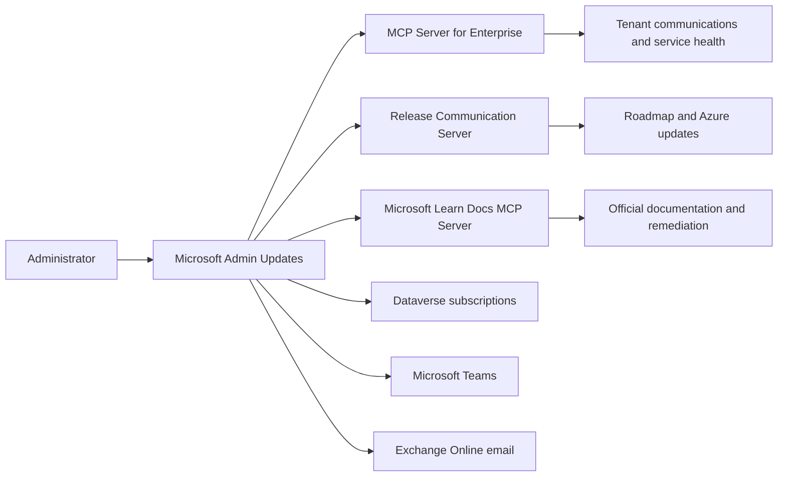

# Microsoft Admin Updates Agent

Microsoft Admin Updates is a Copilot Studio reference agent for Microsoft 365 and Azure administrators. It correlates tenant communications, public release information, and Microsoft Learn documentation, then turns the evidence into concise operational guidance.

This is a community reference implementation. It is not an official Microsoft product and is not covered by Microsoft support.

## Capabilities

- Search tenant-specific Message Center posts and Service Health incidents or advisories.
- Search public Microsoft 365 Roadmap items and Azure Updates.
- Enrich findings with official Microsoft Learn documentation.
- Investigate the relationship between a public change, tenant impact, known issues, and administrator actions.
- Manage per-user weekly digest preferences in Dataverse.
- Deliver filtered weekly digests through Microsoft Teams and email.

## Deployment profiles

Two deployment profiles are generated from the same source:

- **Core:** complete research plus shared Teams or email digest delivery using fixed administrator configuration and no Dataverse.
- **Personalized:** user-owned Dataverse subscriptions with per-admin products, schedules, time zones, and destinations.

See [PROFILES.md](PROFILES.md) for the exact capability and dependency split.

## Evidence model

Each source has a distinct authority:

| Source | Used for |
| --- | --- |
| MCP Server for Enterprise | Tenant Message Center posts and Service Health records |
| Release Communication Server | Public Microsoft 365 Roadmap items and Azure Updates |
| Microsoft Learn Docs MCP Server | Product behavior, prerequisites, limitations, known issues, and remediation |

The agent preserves source-specific IDs, dates, status, scope, and links. It does not infer tenant impact from public information alone.

## Repository layout

| Path | Contents |
| --- | --- |
| `settings.mcs.yml` | Agent identity, model configuration, authentication mode, and core instructions |
| `behaviors/` | Reusable investigation, subscription management, and weekly digest skills |
| `capabilities/tools/` | Copilot Studio tool bindings |
| `connectors/` | Exported custom connector definitions |
| `infrastructure/connections/` | Exported connection reference mappings |
| `settings/` | Additional Copilot Studio settings |
| `workflows/` | Reserved for workflow definitions; currently empty |
| `profiles/` | Declarative file lists for simple and personalized builds |
| `scripts/` | Profile build and sanitized public-history automation |

## Prerequisites

- A Power Platform environment with Copilot Studio authoring access.
- The Copilot Studio extension for Visual Studio Code.
- Access to the MCP Server for Enterprise, Release Communication Server, and Microsoft Learn Docs MCP Server.
- Microsoft Teams or Microsoft 365 Outlook connections for enabled delivery methods.
- For the personalized profile only, Dataverse and a user-owned `Admin Digest Subscriptions` table with appropriate least-privilege security roles.

See [SETUP.md](SETUP.md) for environment preparation and connection rebinding.

## Repository histories

Maintain tenant-bound source in a private repository and publish only a generated, sanitized history. See [HISTORY.md](HISTORY.md) for the migration and ongoing release process.

## Important portability notes

This repository is an exported agent workspace, not a complete Power Platform solution package. Publisher prefixes, schema names, connector IDs, and connection reference names reflect the source environment and must be reviewed when targeting another environment.

The repository does not currently include:

- The Dataverse table definition for `Admin Digest Subscriptions`.
- The scheduled `Daily-MC-Trigger` workflow referenced by the weekly digest behavior.
- Local `.mcs` connection state, authentication tokens, or environment binding files.

Cross-source research can be adapted independently. Simple scheduled delivery requires a fixed-configuration flow. Personalized subscriptions require the missing Dataverse and workflow assets to be recreated or supplied separately.

## Security

The agent uses integrated authentication, group-based access control, invoker connections, and Dataverse ownership as part of its authorization model. Review [SECURITY.md](SECURITY.md) before deploying or reporting a vulnerability.

## Contributing

Contributions are welcome. Read [CONTRIBUTING.md](CONTRIBUTING.md) before opening a pull request.

## License

Licensed under the [MIT License](LICENSE).
